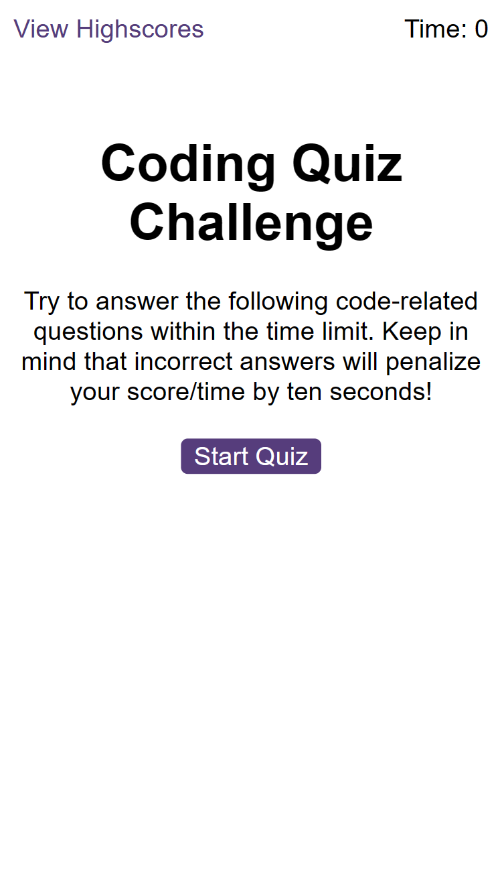

# webapi-code-quiz
Challenge 6 of edX Boot Camp (Front End) to create Code Quiz using Web API.

## Description

For Weekly Challenge 6 of the edX Bootcamp Front End Course, I was given a task of writing code to build a timed coding quiz with multiple-choice questions. The app will run in the browser, and will feature dynamically updated HTML and CSS powered by Javascript code. It will have a clean, polished and responsive user interface.

> What was my motivation?

My motivation was to accelerate my front end skills in web development so I can successsfully secure a web development job. 
I am building on my skills and each week I'm growing from strength to strength and want to achieve top grades throughout 
all the exercises.

>Why I built this project?

Building the website helped me to bridge the gap between theoretical knowledge and practical of applying
my Javascript knowledge that I learnt in Week 6.

> What problem did it solve?

It solved the problem of creating a code assessment something like a developer may be asked to do as part of an interview process.

> What did I learn?

I learnt how to write Javascript and API code that is clean, readable, with comments and is maintainable. I researched 
how to play sound so I wired up a sound if the user answered the question correct and another sound if the question
was answered incorrectly. I also ensured that included material that I learnt in Week 6 (API).

> What makes my project stand out? 

It stands out as I have successfully completed the exercise, used good programming practice, in terms of writing clean code.
I have used appropriate constants and variables that are understandable. There are comments throughout the code
so it can be understood by any developer.  I have pushed myself continually ensuring my work is of the highest quality. The 
code is readable and maintainable. 

My work is identical to the animated gif that we had to achieve. I noticed in the animated gif, that if a person answered the question incorrectly then minus 15/16 was taken off the time remaining. However, I noticed in index.html, it mentions minus 10 seconds and that is what I implemented.

> Technologies Used

* HTML
* Javascript

> Tools Used

* Microsoft Windows 11
* Visual Studio Code
* Git and GitBash
* Git Lab
* Git Hub
* Slack
* Google Chrome Browser
* Notepad
* Windows File Explorer
* Microsoft Paint

## Installation

The GitHub repository for my Web API : Code Quiz can be found at: https://github.com/timsbootcamp/webapi-code-quiz

The source code can be cloned from the above link. 

## Usage

Link to my GitHub Repository: https://github.com/timsbootcamp/webapi-code-quiz

Link to deployed site of my solution to Week 6 : Web API : Code Quiz Challenge : https://timsbootcamp.github.io/webapi-code-quiz/

## Credits

My list of 10 multiple choice questions 
https://www.linkedin.com/pulse/javascript-multiple-choice-quiz-javascript-code-k8jsc/

Adding Sound to Your JS Web App
https://noaheakin.medium.com/adding-sound-to-your-js-web-app-f6a0ca728984

